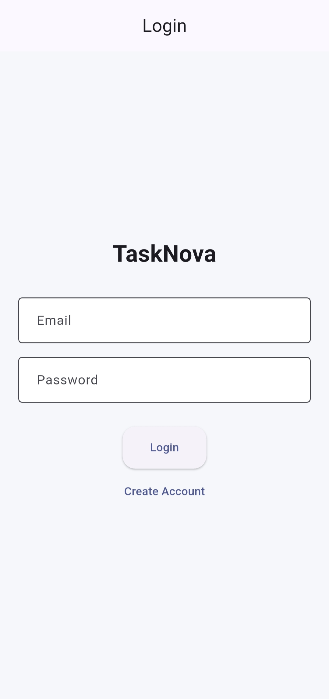
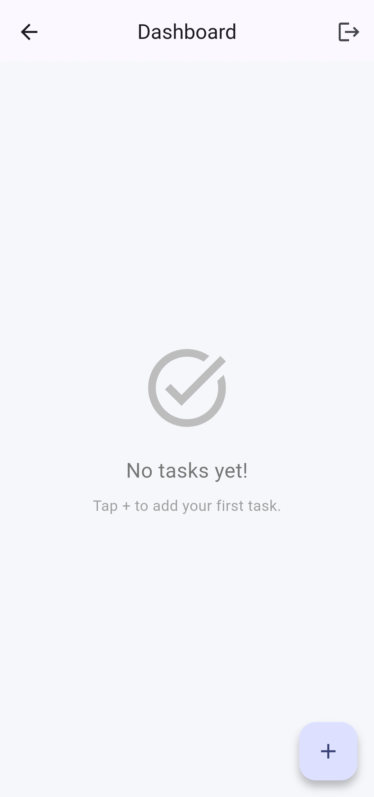
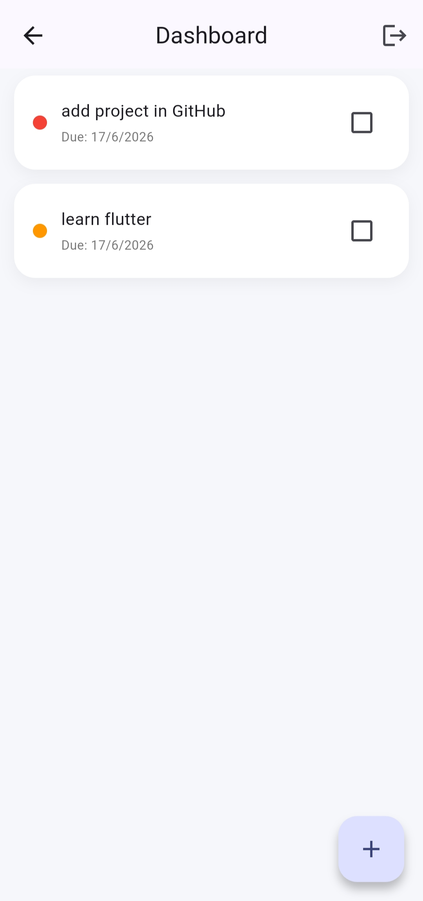
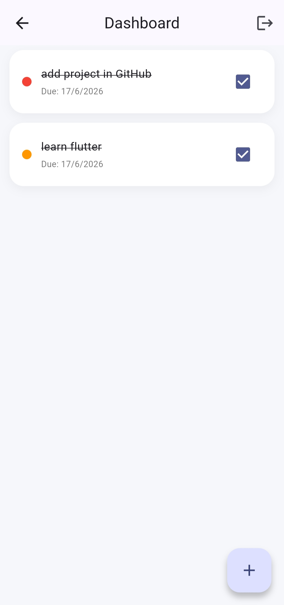
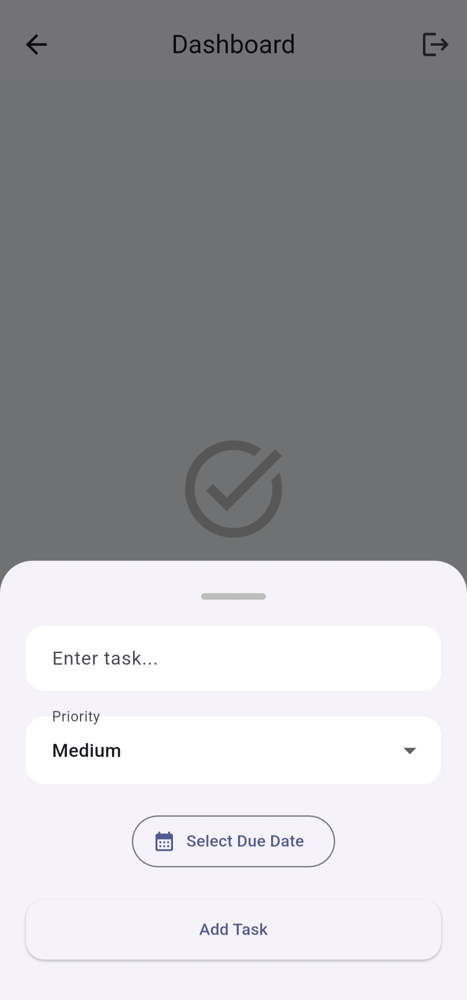

# 📋 TaskNova - Task Management App

TaskNova is a cross-platform task management application built with Flutter and Firebase. It helps users organize, track, and manage their daily tasks through a simple and intuitive interface.

## ✨ Highlights

- Built with Flutter for cross-platform support
- Integrated Firebase Authentication for secure login
- Utilized Cloud Firestore for real-time task storage
- Implemented task priorities and due date tracking
- Designed a clean and responsive user interface

## 🚀 Features

* 🔐 User Authentication with Firebase Auth
* ➕ Create New Tasks
* ✏️ Update Existing Tasks
* 🗑️ Delete Tasks
* ✅ Mark Tasks as Completed
* ⭐ Task Priority Management
* 📅 Due Date Tracking
* ☁️ Real-Time Data Storage with Cloud Firestore
* 📱 Responsive Flutter UI
* 🔄 Instant Task Synchronization

## 📸 Screenshots

### Login Screen

<p align="center">
  
</p>

### Dashboard

<p align="center">
  
  
  
</p>

### Add Task Screen

<p align="center">
  
</p>

## 🛠️ Tech Stack

### Frontend

* Flutter
* Dart

### Backend & Database

* Firebase Authentication
* Cloud Firestore

### Tools

* Android Studio
* VS Code
* Git & GitHub

## 📂 Project Structure

```text
lib/
├── features/
│   ├── auth/
│   │   ├── login_screen.dart
│   │   └── register_screen.dart
│   │
│   └── dashboard/
│       └── dashboard_screen.dart
│
├── firebase_options.dart
└── main.dart
```


## ⚙️ Installation

### Clone the Repository

```bash
git clone https://github.com/shubhgupta22/tasknova.git
```

### Navigate to Project Directory

```bash
cd tasknova
```

### Install Dependencies

```bash
flutter pub get
```

### Run the Application

```bash
flutter run
```

## 🔥 Firebase Setup

1. Create a Firebase project.
2. Enable Firebase Authentication.
3. Enable Cloud Firestore.
4. Configure FlutterFire:

```bash
flutterfire configure
```

5. Run the application.

## 🎯 Future Enhancements

* Task Categories
* Search & Filter Tasks
* Dark Mode
* Offline Support
* Task Analytics
* Push Notifications
* Task Reminders
* Collaborative Task Management

## 👨‍💻 Author

**Shubh Gupta**

* Flutter Developer
* Firebase Developer
* Java Programmer
* B.Tech Computer Science Student (2027)

## 📄 License

This project is developed for learning and portfolio purposes.